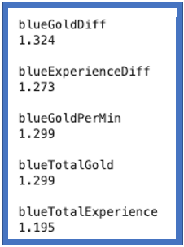

# LeagueofLegendsAnalysis
An Analysis of the game League of Legends. This analysis was published as an article on [Medium](https://medium.com/@jareddelora/analyzing-league-of-legends-bacc71f45026?sk=8a2da716c95b6ae265eb29e32b1e26c4).  

League of Legends (LoL) is a multiplayer online video game developed and published by Riot Games. I won't bore you with the rules but essentially it's a 5v5 match-up where each team's goal is to destroy the opposing team's base (Red vs Blue). The data taken for this analysis is from Kaggle meaning the data is clean and ready for analysis. This isn't a hard problem, but because I've played this game quite a bit I was curious how my views of the game match up with the data. 
  
A typical match is about thirty minutes. The data available from Kaggle gives statistics at 10 minutes into a match along with the eventual match winner. The players considered in this analysis are of a higher rank, so they definitely understand the ins and outs of the game.
The main question to answer: At ten minutes into a LOL match, how well can we predict who will win? 
Ten minutes is fairly early into a LOL match, there is a lot that can happen after 10 minutes. The absolute minimum length of a LOL game is 15 minutes, but they'll often go 40 minutes or longer. My bias going into this analysis was that at 10 minutes into a match I wouldn't be able to predict the winner that well, I was thinking maybe 60% tops.  
  
  
  
Figure 2 shows Logistic Regression odds for several model features. We can see that the features that increase a team's chances of winning are gold and experience related. With gold a player can buy items that make their player stronger, and with experience higher levels are achieved increasing the strength of a player. So at 10 minutes into a match it makes sense that the team with the most money is most likely to win.  
  
But how more likely? How well can we actually predict who will win?  
  
  
   
I wrote a python class called modeler, with a method called analyzer that allowed me to try out different models and parameters easily. In addition to the Logistic Regression Model mentioned above, I also constructed KNN, Random Forest, and Extra Trees classification models. Each of these models were gridsearched over to find the best parameters. Figure 3 shows some of the parameters that were gridsearched over for the Extra Trees Classification model. All of the models I constructed had similar accuracy scores and after searching a bit I found that this number is about what most LOL analyses hit.   
  
The main question that was originally posed: At ten minutes into a LOL match, how well can we predict who will win?  
  
Well it seems from my analysis that if you are ahead at 10 minutes, the odds are definitely in your favor, much more so than I originally thought. In our case with an accuracy score of 0.73, this means that at 10 minutes into a match we are able to predict who will win ~73% of the time. So after 10 minutes into a LOL match, if you're behind you're probably gonna lose.  